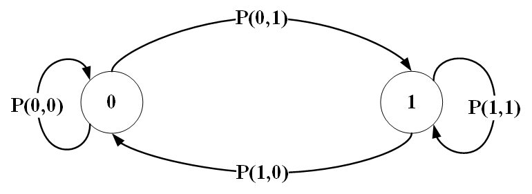

# network-traffic-models

### code segments for various network traffic models

#### two-state discrete Markov chain process

------------

- In this code(`two_state_markov_chain.py`), a series of 1's and 0's can be generated based on a transition probability matrix.
- Transition probability matrix can be defined as follows. 

    P(0,0)				P(0,1) 
    P(1,0)				P(1,1)

- Markov chain model related to this code is illustrated as follows.

#### References
- [Primary radio user activity models for cognitive radio networks: A survey](https://www.sciencedirect.com/science/article/pii/S1084804514000848 "Primary radio user activity models for cognitive radio networks: A survey")
